<!--
  ================================================================
  SYSTEM STATUS: ONLINE
  CHAOS LEVEL: CRITICAL
  AUTHOR: SHADOW (Chief Chaos Engineer)
  ================================================================
-->

<div align="center">

<!-- ANIMATED HEADER -->
<a href="https://git.io/typing-svg">
  
</a>

<br/>

<!-- ANIMATED BANNER -->


<br/>

<!-- BADGES -->
<a href="https://github.com/ryo-a">
  
</a>
<a href="https://github.com/ryo-a">
  
</a>
<a href="https://github.com/ryo-a">
  
</a>

</div>

---

## 🖥️ Mission Control

<div align="center">
<table align="center">
  <tr>
    <td align="center" width="50%">
      <h3>🧠 Identity Module (v3.7-beta)</h3>
      <br />
      <!-- REPLACE 'shadow' WITH YOUR GITHUB USERNAME -->
      <a href="https://github.com/shadow">
        
      </a>
    </td>
    <td align="center" width="50%">
      <h3>📊 Flux Capacitor Metrics</h3>
      <br />
      <!-- REPLACE 'shadow' WITH YOUR GITHUB USERNAME -->
      <a href="https://github.com/shadow">
        
      </a>
    </td>
  </tr>
</table>
</div>

<br />

<div align="center">
<table align="center" width="100%">
<tr>
<td width="60%">

## 🔮 Neural Network of Chaos

```mermaid
graph TD
    subgraph "Core System"
    A[Shadow Unit] -->|Over-engineers| B(Python 🐍)
    A -->|Breaks| C(TypeScript 😐)
    end
    
    subgraph "Capabilities"
    B --> D{AI Agents 🤖}
    D -.->|Hallucinates| E[Production Code]
    B --> F[Automation Scripts ⚡]
    
    C --> G[Frontend That Works™ 🎨]
    G -->|Deletes| H[.next folder 🗑️]
    end
    
    subgraph "Forbidden Knowledge"
    I[Regex] -->|Summons| J((Cthulhu))
    F -->|Deploys to| K[AWS Bill 💸]
    end
    
    style A fill:#333,stroke:#fff,stroke-width:2px
    style E fill:#f00,stroke:#fff,stroke-dasharray: 5 5
    style K fill:#0f0,stroke:#fff,stroke-width:2px
```



</td>
<td width="40%" valign="top">

## 🧩 Tech Stack
<br />

| Tech | Proficiency | Status |
| :--- | :---: | :--- |
| **Python** | `100%` | 🐍 Weaponized |
| **JS/TS** | `85%` | 🤡 Managing |
| **Docker** | `70%` | 🐳 Containerized |
| **AWS** | `1%` | 💸 Bankrupt |
| **Git** | `99%` | 🔥 Force Push |

<br />

### 🎯 Current Focus
> *Refactoring the same 3 lines of code for 4 hours.*

</td>
</tr>
</table>
</div>

---

## 📟 Terminal Logs

```bash
root@shadow-pc:~# tail -f /var/log/daily_routine.log
[09:00:00] INIT: Caffeine injection sequence started... [OK]
[09:15:00] WARN: Deprecated sleep cycle detected. Ignoring.
[10:30:00] EXEC: git push --force origin main
[10:30:01] CRIT: Production servers are smoking.
[10:30:05] ROLLBACK: Attempting to blame timezones... [FAILED]
[11:00:00] PATCH: Hotfix deployed directly to prod.
[12:00:00] INFO: It works on my machine. ¯\_(ツ)_/¯
```

---

## 🪦 Hall of Destruction

<details>
<summary><b>⚠️ CLICK TO EXPAND CLASSIFIED INCIDENTS</b></summary>

<br>

| 💥 Incident | 📉 Impact | 📝 Root Cause |
| :--- | :--- | :--- |
| **The Great Loop** | Infinite AWS Lambda calls | `while(true)` in production |
| **Table Drop** | Deleted User Database | "Thought it was dev env" |
| **CSS Float** | Button covered screen | `z-index: 9999999` |

</details>

---

<div align="center">

### 🧬 SaaS Philosophy

```python
def development_cycle():
    while alive:
        try:
            build_fast()
            break_things()
        except BugFound:
            if time_to_fix > 5_minutes:
                rename_to_feature()
        finally:
            deploy() # yolo
```

<br>


<sub>End of Line.</sub>

</div>
